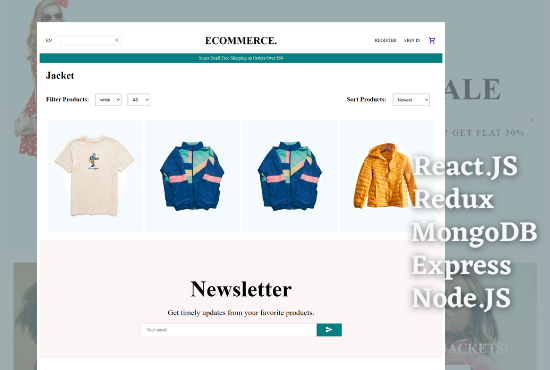
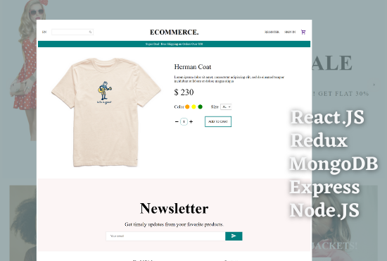
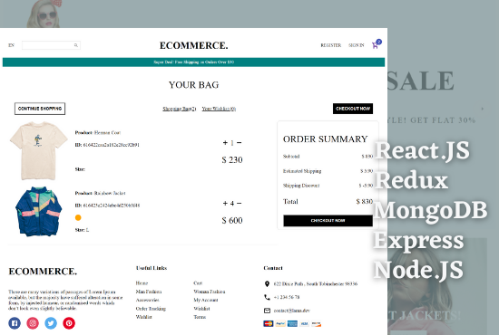
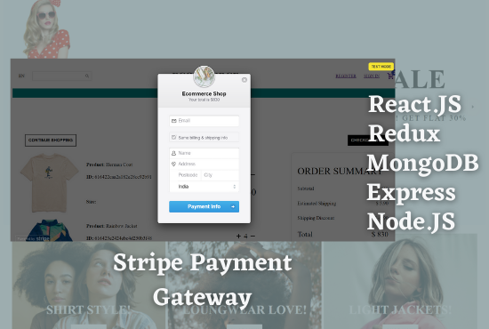

# Ecommerce MERN stack web application

### Technology used:

    MongoDB
    Express.JS
    React.JS / Redux {State management}
    Node.JS
    Stripe Payment gateway

## Ecommerce MERN web app: Home Page

## Ecommerce MERN web app: Product List Page

## Ecommerce MERN web app: Product details Page

## Ecommerce MERN web app: Cart Page

## Ecommerce MERN web app: Payment Gateway Page

# Getting Started with Create React App

This project was bootstrapped with [Create React App](https://github.com/facebook/create-react-app).

## Available Scripts

In the project directory, you can run:

### `npm start`

Runs the app in the development mode.\
Open [http://localhost:3000](http://localhost:3000) to view it in the browser.

The page will reload if you make edits.\
You will also see any lint errors in the console.

### `npm test`

Launches the test runner in the interactive watch mode.\
See the section about [running tests](https://facebook.github.io/create-react-app/docs/running-tests) for more information.

### `npm run build`

Builds the app for production to the `build` folder.\
It correctly bundles React in production mode and optimizes the build for the best performance.

